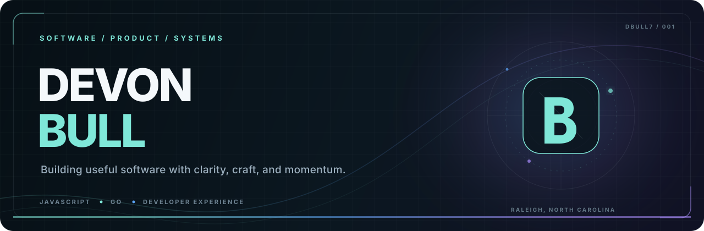

  

 

  
  
  

## Hello — I'm Devon.

I'm a product-minded software engineer and former entrepreneur in Raleigh, North Carolina. I build and operate full-stack products across JavaScript, TypeScript, Go, cloud platforms, and developer tooling.

I work comfortably from frontend experiences and APIs through infrastructure and observability—shipping maintainable systems and helping teams move with confidence. I also enjoy crossing boundaries into Swift, iOS, and hardware-driven projects.

<table>
  <tr>
    <td width="50%" valign="top">
      <h3>01 / End-to-end delivery</h3>
      
Taking products from ambiguous ideas through frontend, API, and production systems.

    </td>
    <td width="50%" valign="top">
      <h3>02 / Cloud & reliability</h3>
      
Operating observable services across cloud and container orchestration platforms.

    </td>
  </tr>
  <tr>
    <td width="50%" valign="top">
      <h3>03 / Developer experience</h3>
      
Building automation and tooling that make the right path the easy path.

    </td>
    <td width="50%" valign="top">
      <h3>04 / Platform breadth</h3>
      
Additional hands-on work across Swift, native iOS, and connected hardware.

    </td>
  </tr>
</table>

## Engineering toolkit

### Languages & application development

  
  
  
  
  
  
  

### Data, cloud & operations

  
  
  
  
  

### Mobile & connected experiences

  
  
  

## Selected work

<table>
  <tr>
    <td width="50%" valign="top">
      <h3><a href="https://github.com/blixai/blix">Blix ↗</a></h3>
      
A CLI and scripting library for creating, automating, and enhancing JavaScript applications.

      JAVASCRIPT · TYPESCRIPT · DEVELOPER TOOLING
    </td>
    <td width="50%" valign="top">
      <h3><a href="https://github.com/DBULL7/fpp-sports">FPP Sports ↗</a></h3>
      
A live pro-sports scoring plugin for Falcon Player, with support for NFL, NCAA football, NHL, and MLB games.

      AUTOMATION · DATA · OPEN SOURCE
    </td>
  </tr>
  <tr>
    <td width="50%" valign="top">
      <h3><a href="https://github.com/DBULL7/xmas_lightshow">Bull Family Light Show ↗</a></h3>
      
The software behind an annual Raspberry Pi-powered show spanning light strands, RGB matrix panels, and new experiments each year.

      RASPBERRY PI · HARDWARE · CREATIVE CODE
    </td>
    <td width="50%" valign="top">
      <h3><a href="https://github.com/DBULL7/uhoops">UHoops ↗</a></h3>
      
A full-stack social network for basketball players, built with React, Redux, Express, and MongoDB.

      REACT · NODE.JS · MONGODB
    </td>
  </tr>
</table>

---

  <h3>Let's build something worth using.</h3>
  

    <a href="https://devonbull.com"><strong>Explore my work</strong></a>
    &nbsp;·&nbsp;
    <a href="https://github.com/DBULL7?tab=repositories"><strong>Browse my code</strong></a>
  

  Clarity in the system. Craft in the details.

